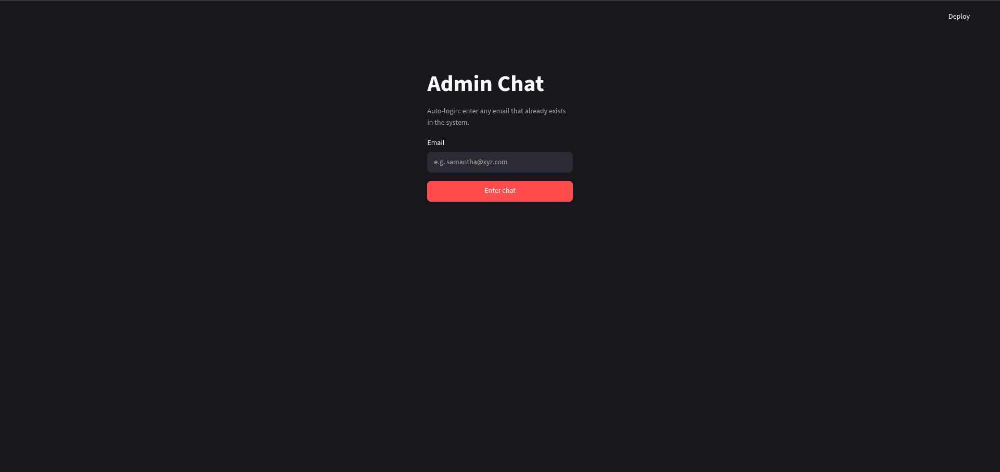
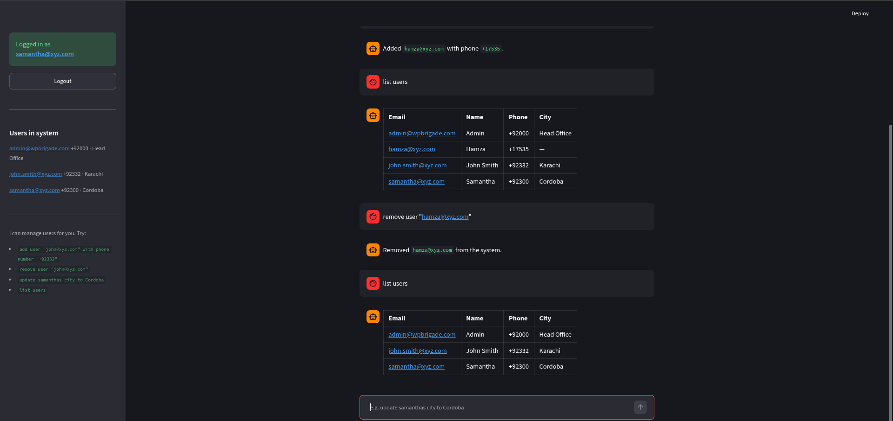

# Admin Chatbot 🤖

> A Streamlit-powered chat interface for managing users through natural language commands.


---

## 📸 Preview

| Auto-Login Gate | Chat Interface & NLU |
|:---:|:---:|
|  |  |

---

## 🚀 Quick Start

### Prerequisites
- Python 3.10+
- pip

### Installation

```bash
# Clone the repository
git clone <your-repo-url>
cd Chatbot

# Create and activate virtual environment (recommended)
python -m venv .venv
source .venv/bin/activate  # Linux/macOS
# .venv\Scripts\activate   # Windows

# Install dependencies
pip install -r requirements.txt

# Run the test suite (optional, ~2 seconds)
python test_commands.py

# Launch the web interface
streamlit run app.py
```

The app will open at **http://localhost:8501**

---

## 🔐 Authentication

The chatbot uses **auto-login** based on email verification:

- Type any email that already exists in the database
- Unknown emails are rejected with an error message
- Pre-seeded demo accounts:
  - `admin@wpbrigade.com` (Admin, Head Office)
  - `samantha@xyz.com` (Samantha, Lahore)
  - `john.smith@xyz.com` (John Smith, Karachi)

---

## ⌨️ Supported Commands

| Command Pattern | Example | Action |
|---|---|---|
| **Add User** | `can you add the user "jane@xyz.com" with phone number "+1234567890"` | INSERT new user |
| **Remove User** | `can you remove the user "jane@xyz.com"` | DELETE user |
| **Update User** | `can you update samanthas city to Cordoba` | UPDATE name/phone/city |
| **List Users** | `list users` | SHOW all users in a table |

### Command Details

#### Add User
- **Required**: Email address
- **Optional**: Phone number
- Name is auto-generated from the email prefix (e.g., `jane.doe@xyz.com` → `Jane Doe`)

#### Remove User
- Requires exact email match (case-insensitive)

#### Update User
- **Identifiers**: Email, exact name, possessive form (`samanthas`), or partial name match
- **Fields**: `name`, `phone` / `phone number`, `city`
- Example: `update john.smith@xyz.com phone to +92300123456`

#### List Users
- Returns a markdown table of all users

---

## 📂 Project Structure

```
Chatbot/
├── app.py              # Streamlit UI & session-based auto-login gate
├── nlu.py              # Natural Language Processing (Regex-based parser)
├── database.py         # SQLite CRUD operations & schema setup
├── test_commands.py    # Headless automated test suite
├── requirements.txt    # Python dependencies
├── chatbot.db          # SQLite database (auto-created on first run)
├── Screenshots/        # Demo screenshots
│   ├── login.png
│   └── chat.png
└── .venv/              # Virtual environment (git-ignored)
```

---

## 🛠️ Technical Details

### Stack
| Layer | Technology |
|---|---|
| **Frontend** | Streamlit (chat UI, session state, auto-login) |
| **Backend** | Python 3.10+ |
| **NLP** | Regex-based intent parsing (`re` module) |
| **Database** | SQLite (zero-config, file-based) |
| **Testing** | Custom test suite with isolated temp database |

### Database Schema
```sql
CREATE TABLE users (
    email TEXT PRIMARY KEY,
    name  TEXT,
    phone TEXT,
    city  TEXT
);
```

### Key Modules

#### `app.py` — Streamlit Application
- Page configuration and styling
- Session-based authentication gate
- Chat history management
- Sidebar with logged-in user info and live user list

#### `nlu.py` — Natural Language Understanding
- Regex patterns for 4 intents: ADD, DELETE, UPDATE, LIST
- Flexible user identification (email, name, possessive, partial)
- Field normalization (phone number → phone)
- Help text generation

#### `database.py` — Persistence Layer
- Connection management with `row_factory`
- Idempotent schema initialization + seeding
- CRUD operations: `add_user`, `remove_user`, `update_user`, `all_users`, `find_user`, `email_exists`

#### `test_commands.py` — Test Suite
- Uses temporary database (isolates from production data)
- Tests all 4 command types + negative case
- Verifies database persistence after updates

---

## 🧪 Running Tests

```bash
# Run the test suite
python test_commands.py
```

Expected output:
```
[PASS] 'can you remove the user "john.smith@xyz.com"'
         -> Removed `john.smith@xyz.com` from the system.
[PASS] 'can you add the user "john.smith@xyz.com" with phone number "+92332"'
         -> Added `john.smith@xyz.com` with phone `+92332`.
[PASS] 'can you update samanthas city to Cordoba'
         -> `samantha@xyz.com` — **city** updated to `Cordoba`.
[PASS] 'list users'
         -> | Email | Name | Phone | City |
[PASS] 'please do a backflip'
         -> Sorry, I didn't understand that.
[PASS] database check: samantha.city == 'Cordoba'

ALL TESTS PASSED
```

---

## 🔧 Configuration

### Environment Variables
No environment variables required. The database path is hardcoded to `./chatbot.db` relative to `database.py`.

### Customizing Seed Users
Edit `SEED_USERS` in `database.py`:
```python
SEED_USERS = [
    ("your@email.com", "Your Name", "+1234567890", "Your City"),
    # ...
]
```

Then delete `chatbot.db` and restart the app to re-seed.

---

## 📝 Development Notes

### Adding New Commands
1. Add a new regex pattern in `nlu.py`
2. Add handling logic in `handle_command()`
3. Add test case in `test_commands.py`

### Extending User Fields
1. Add column to `users` table in `init_db()`
2. Update `add_user()` and `update_user()` in `database.py`
3. Extend `FIELDS` mapping and `RE_UPD` regex in `nlu.py`

---

## 🐛 Troubleshooting

| Issue | Solution |
|---|---|
| `ModuleNotFoundError: streamlit` | Run `pip install -r requirements.txt` |
| `sqlite3.IntegrityError` on add | Email already exists; use a different email |
| "That email isn't in the system" | Check spelling; only seeded emails work initially |
| Port 8501 in use | Run `streamlit run app.py --server.port 8502` |

---

## 📄 License

MIT License — feel free to use, modify, and distribute.

---

## 🤝 Contributing

1. Fork the repository
2. Create a feature branch (`git checkout -b feature/amazing-feature`)
3. Commit your changes (`git commit -m 'Add amazing feature'`)
4. Push to the branch (`git push origin feature/amazing-feature`)
5. Open a Pull Request

---

*Built with ❤️ using Streamlit and Python*